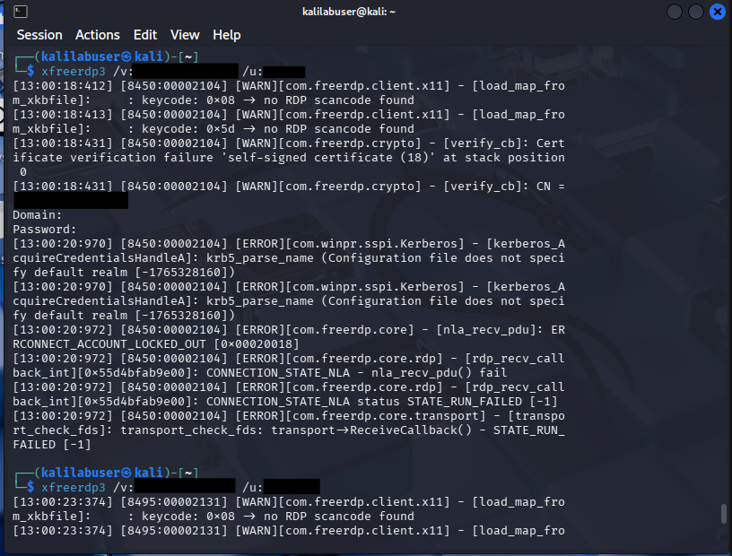
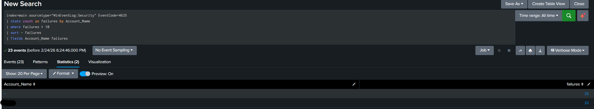
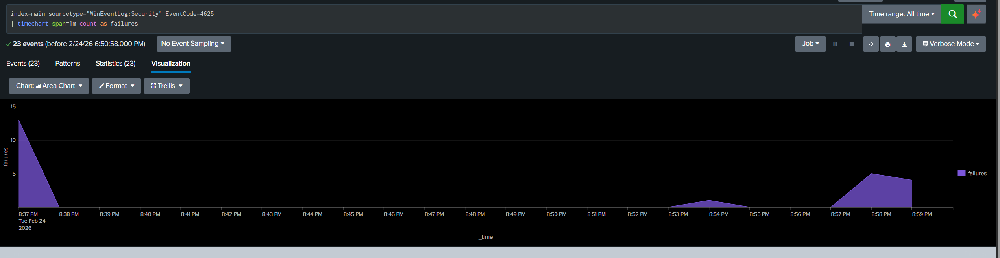
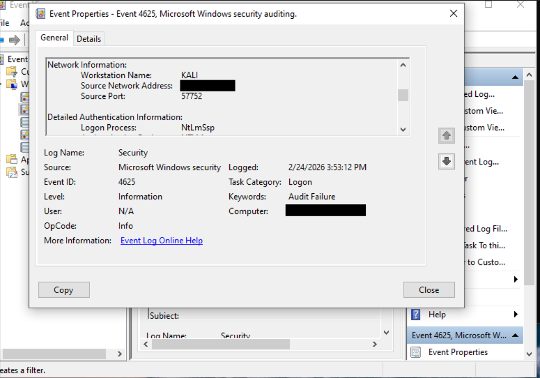
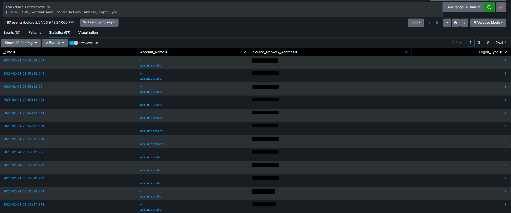

# Splunk Brute Force Detection Lab

In this lab, I built a small SIEM environment using Splunk to detect brute force login attempts against a Windows 10 machine.

I created three virtual machines (Ubuntu Linux, Windows 10, and Kali Linux).

The goal was to understand how brute force attacks appear in logs and how a SOC analyst would detect them.

# Lab Architecture
- Ubuntu VM - Splunk Enterprise (SIEM)
- Windows 10 VM - Target System
- Splunk Universal Forwarder - Log collection agent
- VirtualBox networking (Host-Only + NAT) 

  Log Flow:
  VirtualBox Host-Only -> Windows Security Logs -> Splunk Universal Forwarder -> Splunk Server (Port 9997) -> Detection Searches -> Alerts + Dashboard

# Lab Architecture Diagram

*Figure 1: Overview of the lab setup showing log flow from Windows 10 to the Splunk server via the Universal Forwarder*

# Data Sources
Log Source: Windows 10 Security Event Logs
Forwarder: Splunk Universal Forwarder
Index: wineventlog
Sourcetype: WinEventLog:Security

# Key Event IDs Monitored
- 4624 - Successful Logon
- 4625 - Failed Logon
- 4672 - Special privileges assigned to new logon

#  Attack Simulation

To simulate brute force behavior, I generated repeated RDP login attempts from the Kali Linux VM using xfreerdp3 command.

These attempts created multple Event ID 4625 logs in Windows.

RDP kali command used:

*Figure 2: Repeated RDP authentication attempts generated from the Kali Linux VM to simulate brute force behavior*

# Detection 1 - Multiple Failed Logins

The first detection identifies repeated failed login attempts.

This helped confirm:
- Logs were being ingested correctly
- The attacker IP was visible
- Failed log counts increased during the attack

# SPL Brute Force Detection

*Figure 3: SPL searcg results displaying multiple failed logon attempts (Event ID 4625) from a single source IP*

# Behavioral Visualization
To identify burst patterns, I analyzed failed logins over time to see spikes during the attack window

# Visualization

*Figure 4: Time-based visualization showing spikes in failed login attempts during the attack window*

--
# Detection 2 - Threshold-Based Brute Force Detection
This detection is more realistic
Instead of just counting failures, I grouped failed logins into 5-minute time brackets and flagged activity when attempts exceeded a threshold from a single source IP.
This better represents how a SOC might detect brute force behavior

# Detection Output:

*Figure 5: Aggregated detection identifying excessive failed login attempts within a 5-minute window*

# Log Validation
I verified the attack activity in multiple places:

- Windows Event Viewer (Event ID 4625)
- Splunk raw events (WinEventLog:Security)
- Source_Network_Address field matching the Kali attacker IP

# Windows Event Viewer

*Figure 6: Windows Security Event Viewer confirming Event ID 4625 entries generated by the attack*

# Splunk Raw Events

*Figure 7: Raw Windows Security logs successfully ingested into Splunk (WinEventLog:Security)*
# What I learned
- How to configure Splunk Universal Forwarder
- How Windows authentication logs are structured
- How to write SPL queries for detection
- How brute force activity appears in logs
- How time-based aggregation improves detection accuracy
- How to build and segment a small virtual lab environment
