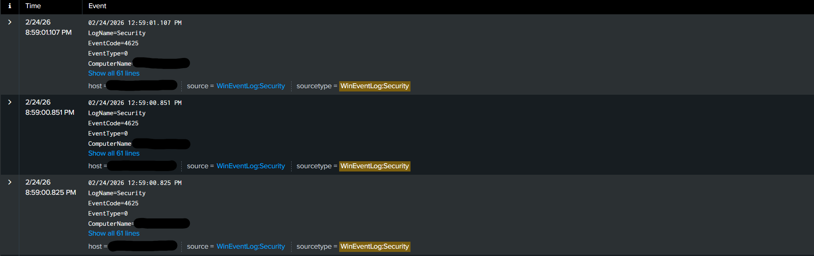
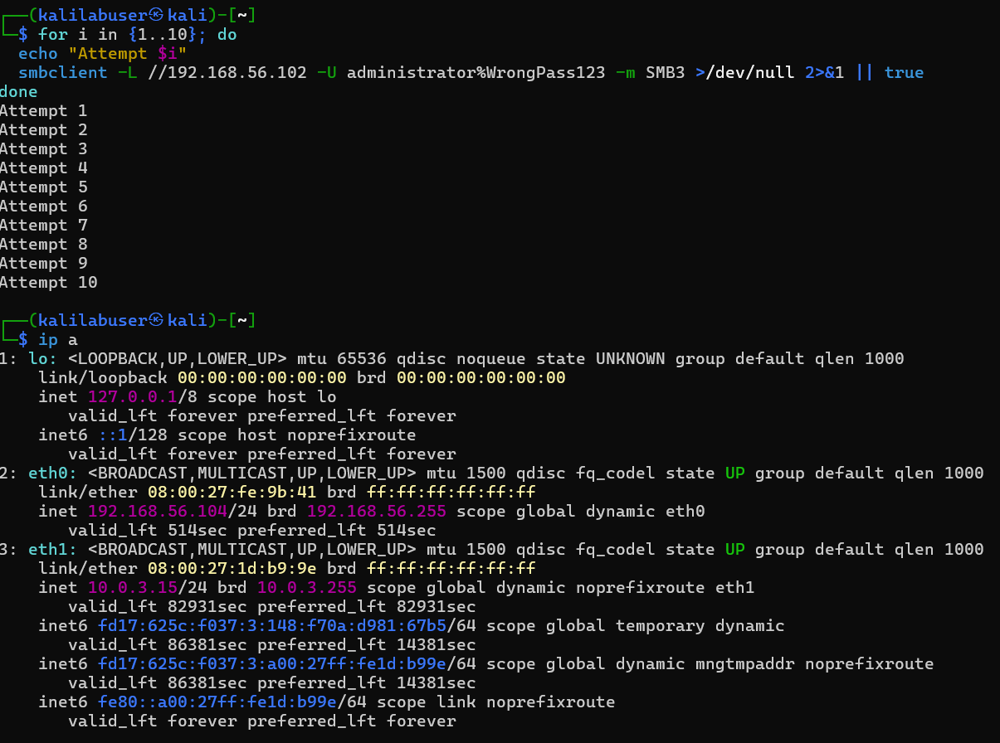

# Spunk Brute Force Detection Lab

In this lab, I built a small SIEM environment using Splunk to detect brute force login attempts against a Windows 10 machine.

I created three virtual machines (Ubuntu Linux, Windows 10, and Kali Linux).

The goal was to understand how brute force attacks appear in logs and how a SOC analyst would detect them.

# Lab Architecture
- Ubuntu VM - Splunk Enterprise (SIEM)
- Windows 10 VM - Target System
- Splunk Universal Forwarder - Log collection agent
- VirtualBox networking (Host-Only + NAT) 

  Data Flow:
  VirtualBox Host-Only -> Windows Security Logs -> Splunk Universal Fowarder -> Splunk Server (Port 9997) -> Detection Searches -> Alerts + Dashboard

# Lab Architecture Diagram

# Data Sources
Log Source: Windows 10 Security Event Logs
Fowarder: Splunk Universal Forwarder
Index: wineventlog
Sourcetype: WinEventLog:Security

# Key Event IDs Monitored
- 4624 - Successful Logon
- 4625 - Failed Logon
- 4672 - Special privileges assigned to new logon

#  Attack Simulation
To simulate brute force behavior, I generated repeated RDP login attempts from the Kali Linux VM using xfreerdp3 command.
These attempts created multple Event ID 4625 logs in Windows.
RDP kali command used:

# SPL Brute Force Detection

# Behavioral Visualization
To identify burst patterns consistent with brute force activity, the following time-based analysis was performed

# Visualization

# Attack Simulation
Repeated RDP authentication attempts were generated from a Kali Linux VM using xfreedp3 to simulate login behavior. These attempts were successful and generated Windows Security Event ID 4625

# RDP kali command

# Log Validation
Windows Security Logs were forwarded to Splunk using the Universal Fowarder and validated in the WinEventLog:Security sourcetype

# Proof

# Detection 2 - Threshold Based Brute Force Detection
# Objective
Detect potential brute-force authentication activity by identifying multiple failed Windows login attempts (Event ID 4625) from a single source IP within a short time window

This detection focuses on behavioral patterns rather than individual failed logins

# Detection Logic
Brute force attacks typically generate:
- Multiple failed login attempts
- From the same source IP
- Within a short time span
- Targeting the same account
To detect this behavior, failed logon events were grouped into 5-minute brackets and aggregated by the source IP address

# Detection Output
The query identified repeated failed autheication attempts from the Kali Linux VM attacker IP within a short time window

# PICTURE

# Attack Simulation
Authenitcation failures were generated from a Kali Linux VM using automated login attempts

# Picture

# Log Validation
The failed authentication events were verified in:
- Windows Events Viewer (Event ID 4625)
- Splunk Raw Events (WinEventLog:Security)
- Source_Network_Address field matched Kali IP

# Picutre

# Picture

